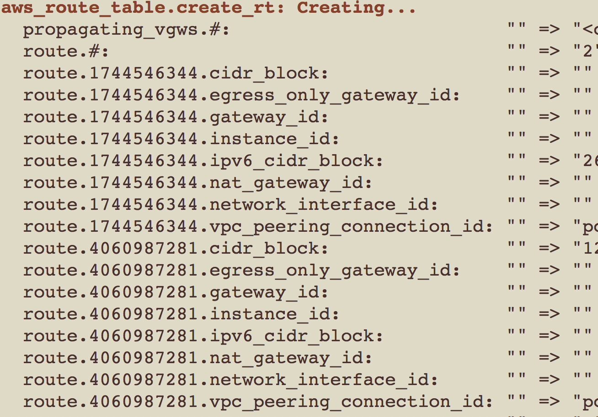

========
fardvag
========

Scripts and resources for developing, debugging, building, and installing the Terraform
Provider AWS plugin.

Currently working on issues related to importing AWS_ROUTE_TABLE.

Related
-------

- Routes being deleted when importing route, then applying:
  `terraform-providers/terraform-provider-aws#5631 <https://github.com/terraform-providers/terraform-provider-aws/issues/5631>`_
- Importing routes?
  `terraform-providers/terraform-provider-aws#704 <https://github.com/terraform-providers/terraform-provider-aws/issues/704>`_
- Original importing routes
  `hashicorp/terraform#13779 <https://github.com/hashicorp/terraform/issues/13779>`_
- The solution may be related to a similar problem encountered with Route 53 records,
  `hashicorp/terraform#14717 <https://github.com/hashicorp/terraform/pull/14717/files>`_

Terraform
---------

- `VPC Resource: Route Table <https://www.terraform.io/docs/providers/aws/r/route_table.html>`_
- `VPC Resource: Route <https://www.terraform.io/docs/providers/aws/r/route.html>`_
- `VPC Resource: Default Route Table <https://www.terraform.io/docs/providers/aws/r/default_route_table.html>`_
- `VPC Resource: Main Route Table Association <https://www.terraform.io/docs/providers/aws/r/main_route_table_assoc.html>`_
- `VPC Resource: Route Table Association <https://www.terraform.io/docs/providers/aws/r/route_table_association.html>`_
- `VPC Resource: VPC Endpoint Route Table Association <https://www.terraform.io/docs/providers/aws/r/vpc_endpoint_route_table_association.html>`_
- `Data Source: Route Table <https://www.terraform.io/docs/providers/aws/d/route_table.html>`_
- `Data Source: Route Tables <https://www.terraform.io/docs/providers/aws/d/route_tables.html>`_
- `Data Source: Route <https://www.terraform.io/docs/providers/aws/d/route.html>`_
- `Acceptance Tests <https://www.terraform.io/docs/extend/testing/acceptance-tests/teststep.html>`_

Amazon
------

- `API Reference: DescribeRouteTables <https://docs.aws.amazon.com/AWSEC2/latest/APIReference/API_DescribeRouteTables.html>`_
- `VPC User Guide: Route Tables <https://docs.aws.amazon.com/AmazonVPC/latest/UserGuide/VPC_Route_Tables.html>`_

In playing around with routing tables, Terraform reports an "id" associated with each route after
creation. It is likely just an internal ID, rather than an ID originating at AWS, yet may provide
some help.

